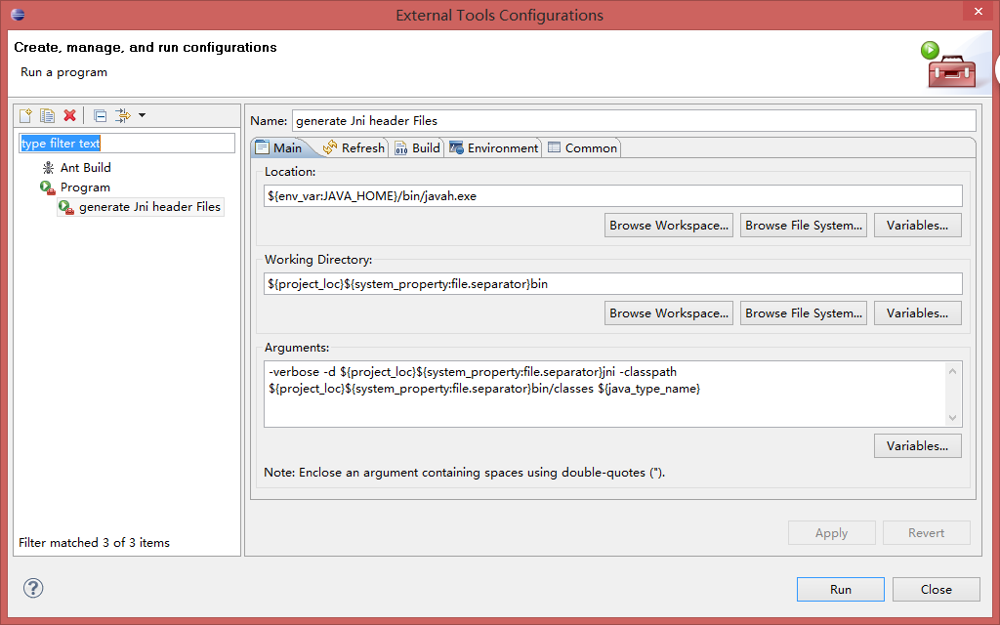

## 通过一个读写INI的例子来描述jni的开发

### 1. 创建自动生成JNI头文件工具
**参考下图**

### 2. 创建本地接口
```java
public native String readIni(String section, String key);
```

```java
public native void WriteIni(String section, String key, String value);
```

### 3. c++实现
```c++
JNIEXPORT jstring JNICALL Java_com_okpay_ui_BaseActivity_readIni(JNIEnv *env,
		jobject obj, jstring section, jstring key) {
	const char *cSection = env->GetStringUTFChars(section, 0);
	const char *cKey = env->GetStringUTFChars(key, 0);
	IniSetting setting("OKPay2.ini");
	const char *value = setting.readIni(cSection, cKey);
	env->ReleaseStringUTFChars(section, cSection);
	env->ReleaseStringUTFChars(key, cKey);
	if (value == NULL)
		return NULL;
	return env->NewStringUTF(gbk2utf8(env, value));
}
```

```c++
JNIEXPORT void JNICALL Java_com_okpay_ui_BaseActivity_WriteIni(JNIEnv *env,
		jobject obj, jstring section, jstring key, jstring value) {
	IniSetting setting("OKPay2.ini");
	char *cSection = jstringTopChar(env, section, "GBK");
	char *cKey = jstringTopChar(env, key, "GBK");
	char *cValue = jstringTopChar(env, value, "GBK");
	setting.setini(cSection, cKey, cValue);
	env->ReleaseStringUTFChars(section, cSection);
	env->ReleaseStringUTFChars(key, cKey);
	env->ReleaseStringUTFChars(value, cValue);
}
```

### 4. java 调用
```java

static {
		System.loadLibrary("OKPayNative");
	}
```

```java

String value = readIni("Server", "Host");

WriteIni("Server", "Host",value);

```
